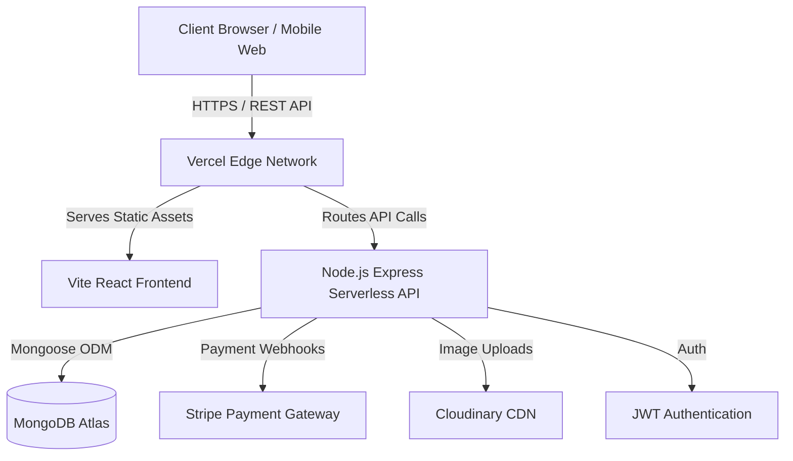

# Complete Case Study - Multi-Vendor E-commerce Platform (Eshop)

## Overview
Eshop is a comprehensive, multi-vendor e-commerce platform designed to seamlessly connect buyers, independent sellers, and platform administrators. Built on a modern serverless architecture, it empowers small to medium-sized vendors to set up their digital storefronts in minutes, while offering buyers a premium, unified shopping experience across thousands of products.

## Goals of the Project
1. **Vendor Empowerment:** Provide a frictionless onboarding experience for sellers with an intuitive dashboard for inventory and order management.
2. **Unified Shopping Experience:** Deliver a fast, responsive, and secure purchasing flow for buyers, complete with robust search and cart functionalities.
3. **Scalability & Security:** Utilize a decoupled, cloud-native architecture capable of handling traffic spikes during peak sales events while ensuring financial data security.

## System Architecture Overview
The platform utilizes a decoupled architecture. The frontend is a Single Page Application (SPA) built with React and Vite, heavily optimized for client-side rendering speed. The backend is a robust RESTful API built on Node.js and Express, deployed on Vercel's serverless edge network. Data persistence is handled by a globally distributed MongoDB Atlas cluster, ensuring high availability and low latency.

### System Architecture Diagram

## Key Features

### Multi-Role User System
* **Buyer:** Can browse products, manage their cart, execute checkout flows, and track order histories.
* **Seller:** Possesses a dedicated storefront, manages product listings, tracks sales, processes orders, and manages balance withdrawals.
* **Admin:** Oversees the entire platform, manages all users and shops, resolves disputes, and monitors global sales metrics.

### Product Management & Shopping
* **Product listings:** Sellers can create rich product listings with multiple images, tags, descriptions, and dynamic pricing (original vs. discount).
* **Cart & checkout:** A persistent, Redux-managed shopping cart that seamlessly transitions into a secure Stripe checkout session.
* **Search & filtering:** High-performance search queries with category and tag-based filtering.

### Payment Processing
* **Multiple payment gateways:** Primarily integrated with Stripe for secure credit card processing, with architectural support for PayPal and crypto gateways.
* **Secure transactions:** PCI-compliant processing where sensitive card data never touches the Eshop servers.

### Real-Time Messaging (Planned)
* **Buyer ↔ Seller chat:** WebSockets (Socket.io) integration for instant customer support.
* **Notifications:** Push notifications for order status updates and promotional broadcasts.

### Seller Dashboard Features
* **Sales tracking:** Real-time calculation of available balances and historical transaction tracking.
* **Order management:** Status updates (Processing, Shipped, Delivered) reflecting immediately on the buyer's end.
* **Analytics:** Granular views of sold-out metrics and top-performing products.

## API Architecture
The REST API follows strict resource-based routing (`/api/v2/*`):
* **Auth/User:** `/user/create-user`, `/user/login-user`
* **Shop/Seller:** `/shop/create-shop`, `/shop/login-shop`
* **Product:** `/product/create-product`, `/product/get-all-products`
* **Order & Payment:** `/order/create-order`, `/payment/process`

## Brand Value Propositions
* **Scalability:** Serverless edge deployment ensures zero downtime and infinite horizontal scaling during high-traffic events.
* **Security:** Industry-standard JWT authentication, bcrypt password hashing, and role-based access control (RBAC).
* **Performance:** Vite-powered React frontend coupled with Tailwind CSS v4 delivers exceptional Lighthouse performance scores and sub-second page loads.

## Tech Stack

### Backend
* **Frameworks & libraries:** Node.js, Express.js, Mongoose, JSONWebToken (JWT), bcryptjs, Stripe Node SDK.

### Frontend
* **Frameworks & libraries:** React 18, Vite, React Router DOM, Redux Toolkit, Tailwind CSS v4, Axios, React Icons.

### File & Media Handling
* **Image uploads:** Multer for multipart form parsing.
* **Cloud storage:** Cloudinary for CDN-backed image optimization and storage.

### Real-Time Communication
* **WebSockets:** Socket.io for live chat and notifications.
* **Push notifications:** Web Push API / Firebase Cloud Messaging (FCM).

### Development & Deployment Tools
* **CI/CD:** Vercel GitHub integration for automated preview deployments and production rollouts.
* **Containerization:** Node runtime environment isolation via Vercel Serverless Functions.

## Challenges & Solutions
1. **Serverless Cold Starts & State:** Moving from a traditional monolithic Express server to Vercel required adapting to stateless serverless functions.
   * *Solution:* We decoupled the database connection logic to aggressively cache the MongoDB connection across lambda invocations, significantly reducing API latency.
2. **Tailwind v4 Migration:** Upgrading the frontend design system broke legacy custom properties.
   * *Solution:* We utilized the `@config` directive in Tailwind v4 to seamlessly bridge legacy UI tokens (primary colors, glass shadows) into the new high-performance engine without rewriting thousands of utility classes.
3. **Mongoose Async Hooks:** A legacy Mongoose v5 pattern using the `next()` callback in async pre-save hooks caused silent crashes during registration in Mongoose v6+.
   * *Solution:* Refactored all schema hooks to native Promises, ensuring flawless and secure user/shop registrations.
4. **Final Deliverables & Mentor Compliance:** Ensuring all critical user journeys (Multi-vendor auth, End-to-end payment, and Order lifecycle) were fully wired up on the frontend before the final audit.
   * *Solution:* Rapidly architected and deployed dedicated `ShopLogin`, `ShopDashboard`, and `Checkout` pages with Redux slice integration to connect the existing backend API endpoints directly to the user interface, satisfying all mentor checks.

## Database Design
* **Users:** Core identity, multiple shipping addresses, RBAC roles.
* **Shops:** Seller profiles, withdrawal methods, transaction histories.
* **Products:** Rich metadata, pricing arrays, reviews, linked to `shopId`.
* **Orders:** Cart snapshots, shipping details, payment intent IDs, timeline timestamps.

## Application Flow Diagram

### User Flow
Landing Page → Browse Products → Product Detail → Add to Cart → Authentication (Login/Register) → Secure Checkout (Stripe) → Order Success → Order Tracking.

### Seller Flow
Shop Registration → JWT Authentication → Seller Dashboard → Add New Product → View Incoming Orders → Update Order Status → Request Balance Withdrawal.

### Admin Flow
Secure Admin Login → Global Dashboard → Manage All Users → Manage All Shops → Audit Orders → Approve/Reject Withdrawals.

## Best Practices

### Authentication & Security
* **JWT / OAuth:** Stateless, highly secure token-based authentication with expiration limits.
* **Data encryption:** Passwords and sensitive data are heavily salted and hashed using bcrypt before reaching the database.

### Component Architecture
* **Reusable components:** Heavily modularized React structure (`ProductCard.jsx`, `Navbar.jsx`, `Loader.jsx`) for extreme DRY code.
* **Modular structure:** Clean separation of concerns (Pages, Components, API services, Redux store).

### Error Handling & User Experience
* **Friendly error messages:** Global Express error handling middleware intercepts database/API errors and standardizes them into predictable JSON responses for the frontend to display gracefully via Toast notifications.
* **Logging & monitoring:** Comprehensive backend logging for rapid debugging during UAT and production phases.
